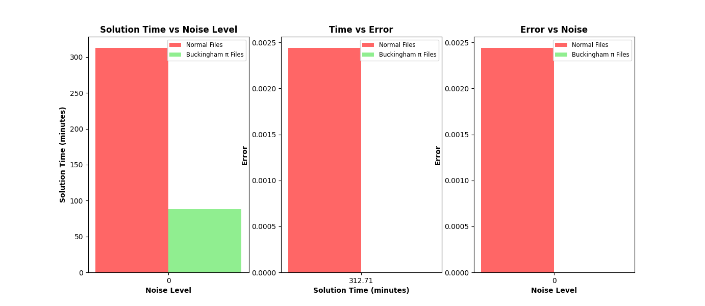

# AI-Feynman

## Machine Specs

M1 Macbook Pro: 8 Core CPU and 8 Core GPU

## Performance Graphs

### Example 1

Model parameters: BF_try_time=60, BF_ops_file_type="7ops.txt", polyfit_deg=3, NN_epochs=500

#### Expected

Normal: s = s0 + v0 * t - 0.5 * a * t**2

Buckingham π: -0.5π₂π₃² + π₃ + 1

#### Found

##### Equations found with normal:

Noise Level: 0 | Equation: 0.000000000000+(x0+(((x3*(x1+(x1-(x3*x2)))))/((0+1)+1)))

Noise Level: 0.01 | Equation: 0.000055730232+(x0+(((x3*(x1+(x1-(x3*x2)))))/((0+1)+1)))

Noise Level: 0.05 | Equation: sqrt(0.000452721013*(x2+(x1+x1)))

Noise Level: 0.1 | Equation: asin(1.839030019605+(-sqrt((x3+1))))

where x0 is s0, x1 is v0, x2 is a, & x3 is t

##### Equations found with Buckingham π:

Noise Level: 0 | Equation: 0.500000000000*(((x1*(((x1*(-x0))+1)+1))+1)+1)

Noise Level: 0.01 | Equation: 0.500320478519*((x1+((x1*((x1*(-x0))+1))+1))+1)

Noise Level: 0.05 | Equation: 0.501244731139*(((x1*(((x1*(-x0))+1)+1))+1)+1)

Noise Level: 0.1 | Equation: 0.493612853809*(((x1*(((x1*(-x0))+1)+1))+1)+1)

where x0 is π₂ & x1 is π₃


### Example 2

Model parameters: BF_try_time=100, BF_ops_file_type="7ops.txt", polyfit_deg=3, NN_epochs=500

#### Expected

Normal: vt = ((2 * m * g) ** 0.5)/ (((rho * Cd * A) ** 0.5))

Buckingham π: π₃ = 2π₂/(π₁)²

#### Found

##### Equation found with normal:

Noise Level: 0 | Equation: 1.414213562373 * sqrt((x1*(x0/(x4*(x3*x2)))))

where x0 is m, x1 is g, x2 is rho, x3 is Cd, & x4 is A

##### Equation found with Buckingham π:

Noise Level: 0 | Equation: 0.000000000000+((x1+x1)/(x0*x0))

where x0 is π₁ & x1 is π₂




# Conclusion

## Example 1

It can be clearly noted that Buckingham π implementations tends to be 3-6 times faster than traditional methods. The solution time is consistently smaller than the normal equation data generated files, which tend to grow with more noise. Though both do struggle to represent the true parent equation at various noise tolerances, Buckingham π has significantly less error. It is also interesting to note that while the Buckingham π files also do possess high error, that only because they are being compared to the dataset that has noise. When comparing them to the orginal they are actually were close to each other and represent the parent equation very well.

## Example 2

Although the parent equation in this example is considerably more complex leading to larger solution times for both, Buckingham π implementations allowed for there to be less error and marginally faster than the normal data files. With the same notes from the previous example, it can be added that the computational power of the machine will obviously further underline the difference in the times and errors.

# Citation

If you compare with, build on, or use aspects of the AI Feynman work, please cite the following:

```
@article{udrescu2020ai,
  title={AI Feynman: A physics-inspired method for symbolic regression},
  author={Udrescu, Silviu-Marian and Tegmark, Max},
  journal={Science Advances},
  volume={6},
  number={16},
  pages={eaay2631},
  year={2020},
  publisher={American Association for the Advancement of Science}
}
```

```
@article{udrescu2020ai,
  title={AI Feynman 2.0: Pareto-optimal symbolic regression exploiting graph modularity},
  author={Udrescu, Silviu-Marian and Tan, Andrew and Feng, Jiahai and Neto, Orisvaldo and Wu, Tailin and Tegmark, Max},
  journal={arXiv preprint arXiv:2006.10782},
  year={2020}
}
```
