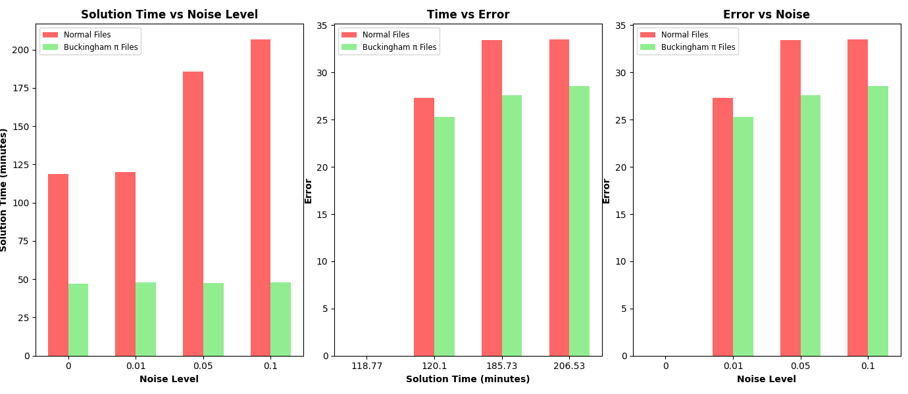

# AI-Feynman

## Performance Graphs

Example 1: BF_try_time=60, BF_ops_file_type="7ops.txt", polyfit_deg=3, NN_epochs=500



# Citation

If you compare with, build on, or use aspects of the AI Feynman work, please cite the following:

```
@article{udrescu2020ai,
  title={AI Feynman: A physics-inspired method for symbolic regression},
  author={Udrescu, Silviu-Marian and Tegmark, Max},
  journal={Science Advances},
  volume={6},
  number={16},
  pages={eaay2631},
  year={2020},
  publisher={American Association for the Advancement of Science}
}
```

```
@article{udrescu2020ai,
  title={AI Feynman 2.0: Pareto-optimal symbolic regression exploiting graph modularity},
  author={Udrescu, Silviu-Marian and Tan, Andrew and Feng, Jiahai and Neto, Orisvaldo and Wu, Tailin and Tegmark, Max},
  journal={arXiv preprint arXiv:2006.10782},
  year={2020}
}
```
